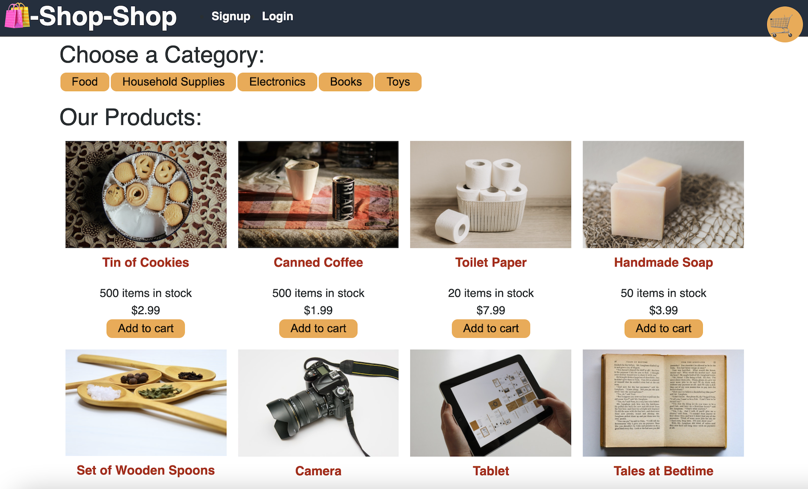

# Shop-Shop (Refactored)

  

  ## Description

  Shop-Shop is a React App built for an e-commerce site. The site uses Stripe to handle payment processing, and allows users to add, edit, delete items from their cart. This codebase has been refactored to use Redux for managing state. For more information on what that means, or to see Redux for yourself, click [here](https://redux.js.org/).

  

  ## Table of Contents

  * [Installation](#installation)
  * [Usage](#usage)
  * [Deployed App](#deployed-application)
  * [License](#license)
  * [Questions](#questions)
  
  ## Installation

  Follow these steps for installing this project:

  If you want to work with this codebase, clone the repository to your machine and run the command `npm i` in the `root`, `client`, and `server` folders to install the needed packages and dependencies.

  ## Usage

  To start the development environment, run the command `npm run develop` from the root of the codebase.

  ## Deployed Application

  To see this app in action, click [here](https://desolate-shore-43055.herokuapp.com/).

  ## License

  This project is licensed with The Unlicense. Click the icon at the top of the ReadMe for the full license information.

  ## Questions

  If you have questions about this project please contact me at [crawleyj2@gmail.com](mailto:crawleyj2@gmail.com).
  More of my work can be found on GitHub at [crawleyj2](https://github.com/crawleyj2)

